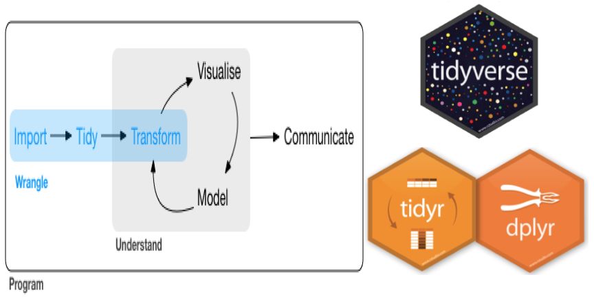
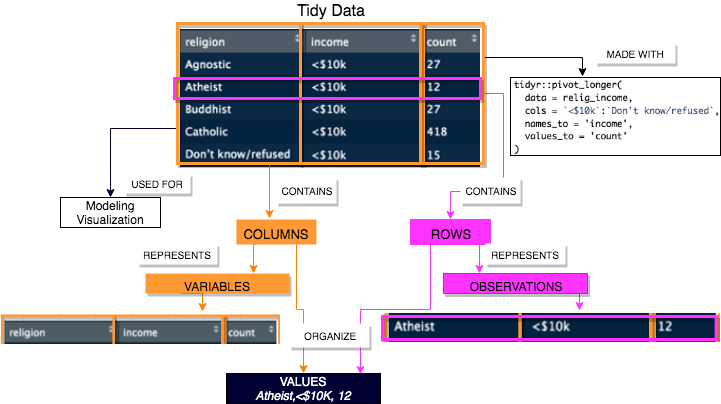

```{r setup, include=FALSE}
knitr::opts_chunk$set(collapse = TRUE, comment = "#>", message = FALSE, error = FALSE, warning = FALSE,
                      echo = FALSE)
options(dplyr.print_max = 5)
#devtools::install_github("tidyverse/tidyr")
#devtools::install_github("chrk623/dataAnim")
#install.packages('kableExtra')
library(knitr)
library(kableExtra)
library(dplyr)
library(tidyr)
```


<style>
.column-left{
  float: left;
  width: 46%;
  text-align: left;
}
</style>

<style>
.column-left-wide{
  float: left;
  width: 63%;
  text-align: left;
}
</style>

<style>
.column-left-narrow{
  float: left;
  width: 33%;
  text-align: left;
}
</style>

## Data Wrangling: Tidying

- Covered in detail in [R for Data Science](http://r4ds.had.co.nz/index.html)
    + This content adapted from this & [tidyr documentation](https://tidyr.tidyverse.org/dev/articles/pivot.html)
- Tools from the [`tidyverse`](https://www.tidyverse.org/)

 <center></center>

## Tidy Data

<div class="column-left-wide">
<left></left>

relig_income data[^relig_income]

[^relig_income]:The relig_income dataset comes from a report produced by the Pew Research Center, examining the relationship between income and religion in the U.S.

</div>

<div class="column-left-narrow">

- each **variable** must have its own **column**
- each **observations** must have its own **row**
- each **value** must have its own **cell**
  + Impossible to satisfy 2 of 3 rules
  
- Why Tidy?
  + Key R functions (i.e., mutate, select, ggplot, filter) work on vectors of values
  + Consistency in storage = consistency in tools that work
  
</div>
  
## How do I do it?

1. Figure out what the variables and observations are
2. Figure out if you need to your table to be
   - longer: one variable spread across multiple columns
   - wider: one observation scattered across multiple rows

- Two key tidyr functions for solving
  + pivot_longer (previously gather)
    - makes datasets longer by increasing the number of rows and decreasing the number of columns
  + pivot_wider  (previously spread)
    -  "widens" data, increasing the number of columns and decreasing the number of rows

- Let's try it out! 
  + Please open the Condensed_TidyData_report.Rmd file


